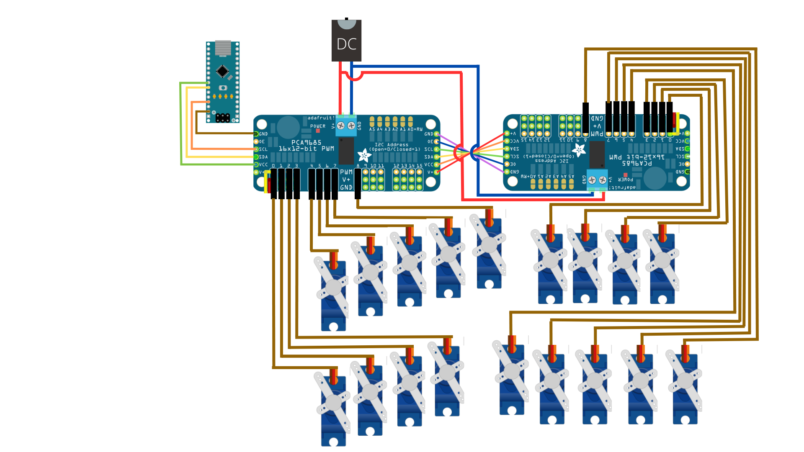
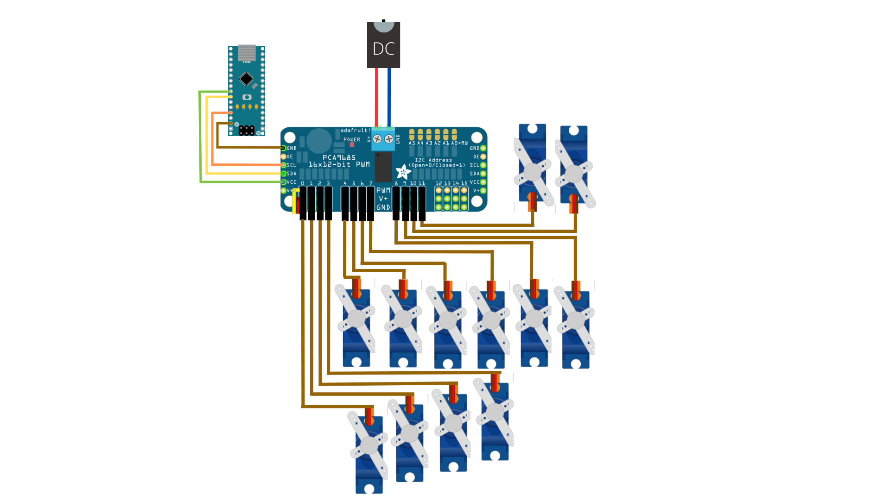

# Xylophone

This Python project 🪄✨ enables communication with an actual xylophone via a Client-Server setup. A Client sends notes to the Server and instructs it to play the music. The Server, in turn, directs the execution. Two Server modes are provided: one for a physical xylophone 🎹🎶 and another that simulates.

  
        <source src="xylophone/VID_20220408_162259 - Trim.mp4" type="video/mp4"
        
## Assembly: 

### Electrical Diagram:

 

 
 
### Components: 

The xylophone consists of the following components:
<ul> 
<li> 28 short mallets of wood 
<li> 28 MicroServo 9g  SG90 
<li> 4 support leags of wood (⌀22mm x 33mm)
<li> 8 support leags of wood (⌀22mm x 39mm)      
<li> 7 support leags of wood (⌀22mm x 52mm)
<li> 1 wood stick  (⌀6mm x 655mm)
<li> 1 wood stick  (⌀6mm x 735mm)
<li> 20 screws 
<li> 3 PCA9685 16-Channel 12 Bit PWM Driver 
<li> 2 Arduino nano (it can be others models of Arduino) 
<li> wooden Frame Model A 
<li> Wooden Drame Model B
<li> 2 DC Plug 5,5 mm 
<li> 2 DC Female 5,5 mm 
</ul


## Installation

In order to use this library in another project it must be installed.
This is fairly straightforward as it can be installed with pip.
Execute the following steps:

1. Clone the repository.

```shell
$ git clone https://github.com/udesa-ai/xylophone.git
```

1. Get in the local repository.

```shell
$ cd /path/to/xylophone
```

1. Install the dependencies.

```shell
$ pip install -r requirements.txt
```

1. Install it with pip

```shell
$ pip install .
```

## Usage

The usage is also quite easy as it requires to interact with just a few classes.
First we'll show you how to write a xylophone client that can send commands to the xylophone server.

### Client

The supported notes are:

| #  | Note | #   | b   |
|----|------|-----|-----|
| 1  | C7   | C#7 | Cb7 |
| 2  | B6   | -   | Bb6 |
| 3  | A6   | A#6 | Ab6 |
| 4  | G6   | G#6 | Gb6 |
| 5  | F6   | F#6 | -   |
| 6  | E6   | -   | Eb6 |
| 7  | D6   | D#6 | Db6 |
| 8  | C6   | C#6 | -   |
| 9  | B5   | -   | Bb5 |
| 10 | A5   | A#5 | Ab5 |
| 11 | G5   | -   | -   |
| 12 | F5   | -   | -   |
| 13 | E5   | -   | Eb5 |
| 14 | D5   | D#5 | Db5 |
| 15 | C5   | C#5 | -   |
| 16 | B4   |  -  | Bb4 |
| 17 | A4   | A#4 | Ab4 |
| 18 | G4   | G#4 | -   |


```python
from xylophone.client import XyloClient
from xylophone.xylo import XyloNote

# Create and store all the notes in a single list.
notes = [
    XyloNote('A4', 1.5, 90),
    XyloNote('A4', 2.3, 90),
    XyloNote('G#6', 5.33333, 90),
    XyloNote('A4', 10.01, 90),
    ]

# Instantiate the client with the IP address or host, and the port.
# Take a look at the server you spun up or ask someone else for this info.
client = XyloClient(host='localhost', port=8080)

# Load the notes
client.load(notes)

# Play the song
client.play()
```

You can use the example in [here](examples/xilo_client.py).

### Server

This tiny library provides two servers:

- A server that connects to a real xylophone by USB.
- A mock server that has the same interface as the real one but just acknowledges the sent message.

#### Mock server

To instantiate a mock server it's also very easy as it requires to import only one class from this library.

```python
# Import the mock server
from xylophone.server.server import MockXyloServer

# Instantiate the mock server and specify the IP/host and port that it's going to be using.
server = MockXyloServer(host='localhost', port=8080)

# Just start the server
server.start()
```

#### Real server

It's the same but it must be connected to a real robotic xylophone by USB.

```python
# Import the xylo server
from xylophone.server.server import XyloServer

# Instantiate the xylo server and specify the IP/host and port that it's going to be using.
server = XyloServer(host='localhost', port=8080)

# Just start the server
server.start()
```

> Note: Keep in mind that these scripts won't terminate unless you do it.
